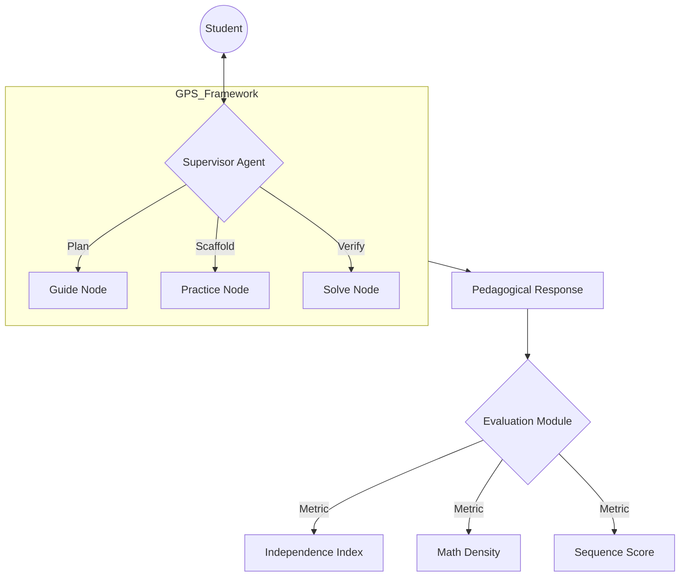

# EMNLP 2026 Submission Strategy: GPS-Agent Framework

Dự án **GPS AIedu** hiện đã có nền tảng dữ liệu cực kỳ mạnh mẽ (Cohen's d = 1.209, 2.375 phiên hội thoại). Để nộp bài cho **EMNLP 2026**, chúng ta sẽ tập trung vào việc chuẩn hoá quy trình nghiên cứu theo tiêu chuẩn của ACL (Association for Computational Linguistics).

## 1. Định hướng nộp bài (Tracks)

Chúng ta có 2 lựa chọn chiến lược:
*   **Main Track (ARR - ACL Rolling Review)**: Nếu muốn nhấn mạnh vào **Lý thuyết Sư phạm & Phân tích Hành vi (NLP for Education)**. Hạn nộp ARR gần nhất là **25/05/2026**.
*   **Industry Track**: Nếu muốn nhấn mạnh vào **MLOps, Scalability (Simulation) và Hiệu năng thực tế**. Hạn nộp là **16/06/2026**.

> [!TIP]
> **Khuyến nghị**: Nên chọn **Industry Track** vì dự án có phần "Massive Simulation" (2.150 phiên augment) và các chỉ số đo lường thực tế (Hake's Gain, Latency) rất phù hợp với xu hướng "Real-world Deployment" của nhánh này.

---

## 2. Cấu trúc bài báo (Research Paper Outline)

### Title: *GPS-Agent: A Multi-Agent Scaffolding Framework for Quantifiable Student Autonomy in Math Education*

| Chương | Nội dung trọng tâm | Key Metrics/Visuals |
| :--- | :--- | :--- |
| **Abstract** | Giới thiệu framework GPS, giải quyết vấn đề "phụ thuộc AI" trong giáo dục. | Cohen's d = 1.209 |
| **Introduction** | Nghịch lý của LLM trong giáo dục (quá sẵn lòng cho đáp án). Giới thiệu framework G-P-S. | — |
| **Methodology** | Kiến trúc Multi-Agent (LangGraph): Supervisor, Guide, Practice, Solve. Cơ chế Faded Scaffolding. | Diagram kiến trúc Agents |
| **Data Generation** | Quy trình Behavioral Simulation (225 thực + 2150 augment). Cách tạo Gold Standard. | Diversity of Personas |
| **Experiments** | Thiết lập thí nghiệm Pilot vs. Large-scale. Các chỉ số đo lường mới. | Independence Index (II) |
| **Results** | Phân tích Hake's Gain, Sequence Chaos Index, Math Density. | PCA Clustering, Markov Matrix |
| **Discussion** | Hiệu quả của Fading Scaffolding (II tăng từ 0.29 lên 0.335). | Independence Trend Chart |
| **Conclusion** | Tiềm năng ứng dụng thực tế và mở rộng cho các môn học khác. | — |

---

## 3. Lộ trình thực hiện (Roadmap)

### Phase 1: Hoàn thiện Dataset & Benchmark (7/5 - 15/5)
- [ ] Chạy script `scripts/build_gold_standard_v2.py` để chốt bộ dữ liệu chuẩn nhất.
- [ ] Xác thực tính "toán học" (Math Density) của 2.375 phiên bằng `scripts/generate_research_stats.py`.
- [ ] Tạo bảng so sánh chi tiết giữa GPS-Agent và "Vanilla LLM" (Non-GPS).

### Phase 2: Viết bản thảo (Drafting) (16/5 - 5/6)
- [ ] Viết phần Methodology mô tả chi tiết Prompting Strategy (V1.2).
- [ ] Vẽ sơ đồ Markov Chain mô tả quá trình chuyển đổi trạng thái của học sinh.
- [ ] Phân tích PCA Clustering để mô tả 3 nhóm học sinh (Fast Learner, Structured, At-Risk).

### Phase 3: Review & Submission (6/6 - 16/6)
- [ ] Kiểm tra tính ẩn danh (Double-blind review) cho EMNLP.
- [ ] Nộp bản thảo cho Industry Track.

---

## 4. Sơ đồ kiến trúc đề xuất trình bày (Presentation Spec)

## 5. Các "Key Selling Points" cần nhấn mạnh
1. **Large-scale Behavioral Dataset**: Một trong những bộ dữ liệu hội thoại sư phạm tiếng Việt lớn nhất (2,300+ sessions).
2. **Quantifiable Autonomy**: Lần đầu tiên đưa ra chỉ số `Independence Index` để đo lường mức độ tự chủ của học sinh thay vì chỉ đo điểm số.
3. **Multi-Agent Robustness**: Khả năng điều phối các Agent chuyên biệt giúp giảm "hallucination" và kiểm soát luồng sư phạm tốt hơn.
