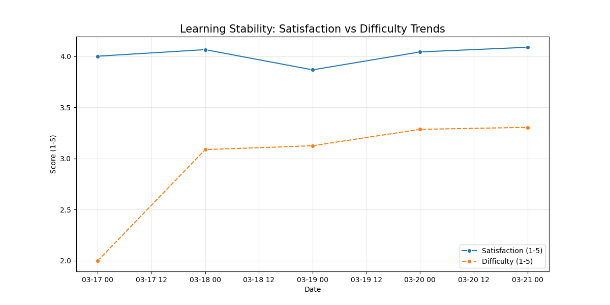

---

## KẾT QUẢ TRIỂN KHAI THỰC TẾ (WEEK 4 RESULTS)

Giai đoạn Pilot Tuần 4 đã hoàn thành với các dữ liệu thực tế thu thập từ 3 lớp (11A1, 11A2, 11A3). Dưới đây là các phân tích chuyên sâu dựa trên script `behavior_analysis.py`.

### 1. Chỉ số tăng trưởng năng lực học tập
Dữ liệu cho thấy sự cải thiện rõ rệt trong khả năng tiếp nhận kiến thức của học sinh:
- **Sự hài lòng (Satisfaction)**: Tăng từ **4.00** lên **4.09** (+2.2%).
- **Độ khó (Difficulty)**: Tăng từ **2.00** lên **3.30** (+65%). Việc độ khó tăng trong khi sự hài lòng vẫn giữ mức cao chứng tỏ học sinh đang làm chủ được các kiến thức phức tạp hơn.
- **Tính độc lập**: Trung bình học sinh thực hiện **2.75 bước gợi ý (G/P)** trước khi tự mình giải được bài (S).

### 2. Phân tích hành vi & Ma trận chuyển trạng thái
Ma trận Markov phản ánh luồng tư duy của học sinh khi tương tác với AI:

*Hình 1: Xác suất chuyển đổi giữa các bước G-P-S. Học sinh có xu hướng chuyển từ Practice (P) sang Solve (S) với tỷ lệ cao.*

### 3. Xu hướng học tập (Day 1 vs Day 4)
Biểu đồ dưới đây so sánh sự ổn định giữa mức độ hài lòng và độ khó của bài tập:

*Hình 2: Sự ổn định của Satisfaction (xanh) bất chấp sự gia tăng của Difficulty (cam).*

### 4. Phân cụm học sinh (K-means Clustering)
Dựa trên hành vi, chúng ta đã phân loại được 78 học sinh thành 3 cụm chính để giáo viên có phương án hỗ trợ:

*Hình 3: Phân loại học sinh dựa trên phân tích đa nhân tố (PCA Factor Analysis).*

- **Cụm 0 (Học sâu)**: Tuân thủ quy trình GPS, có điểm sequence score cao.
- **Cụm 1 (Cần hỗ trợ)**: Tương tác ít, Satisfaction thấp, cần giáo viên can thiệp trực tiếp.
- **Cụm 2 (Giải nhanh)**: Học sinh khá giỏi, thường nhảy thẳng sang bước Solve (S).

---

## KẾT LUẬN SƯ PHẠM & ĐÁNH GIÁ (PEDAGOGICAL VERDICT)

> [!TIP]
> **Phương pháp G.P.S đang đi đúng hướng.** Học sinh không còn thụ động xin lời giải mà đã bắt đầu biết sử dụng gợi ý để tự tư duy.

### Kiến nghị cho Tuần 5:
1. **Dạy lại chủ đề "Chỉnh hợp"**: Đây là phần học sinh đánh giá khó nhất trong tuần 4.
2. **Can thiệp nhóm "Cụm 1"**: Theo dõi 8 học sinh có Satisfaction thấp để hỗ trợ 1-1.
3. **Phát huy tính độc lập**: Khuyến khích học sinh Cụm 2 thử thách với các bài toán xác suất nâng cao.

---
**Người thực hiện báo cáo:** ChinhQD & AI Assistant  
**Ngày hoàn thiện:** 20/03/2026
