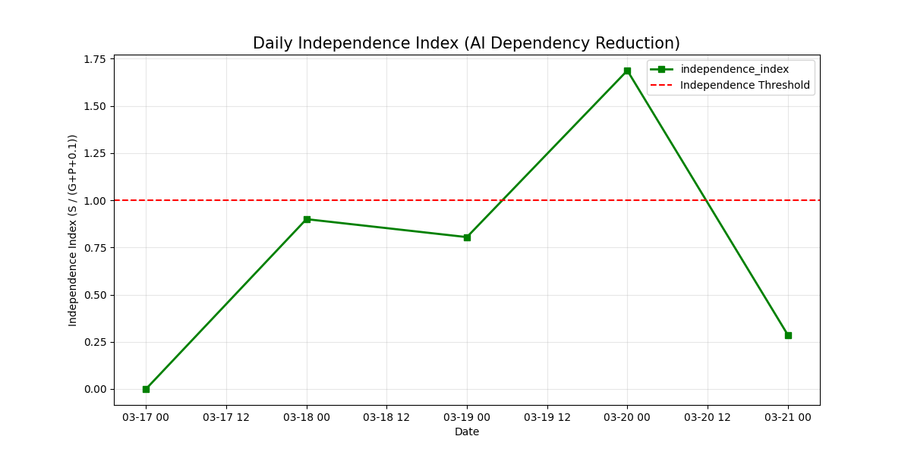
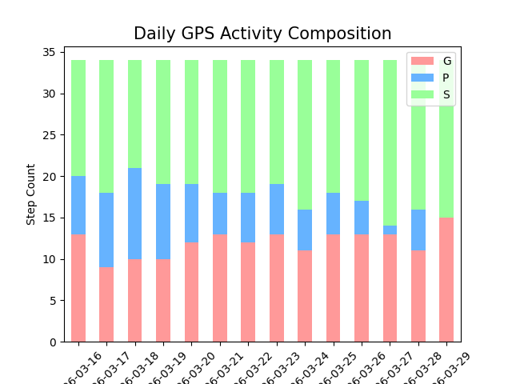
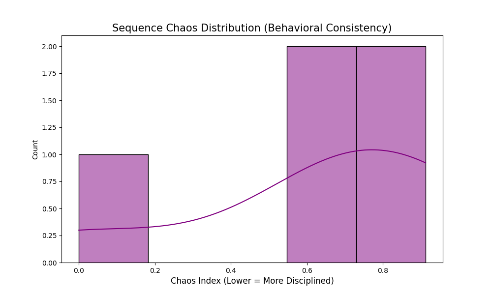
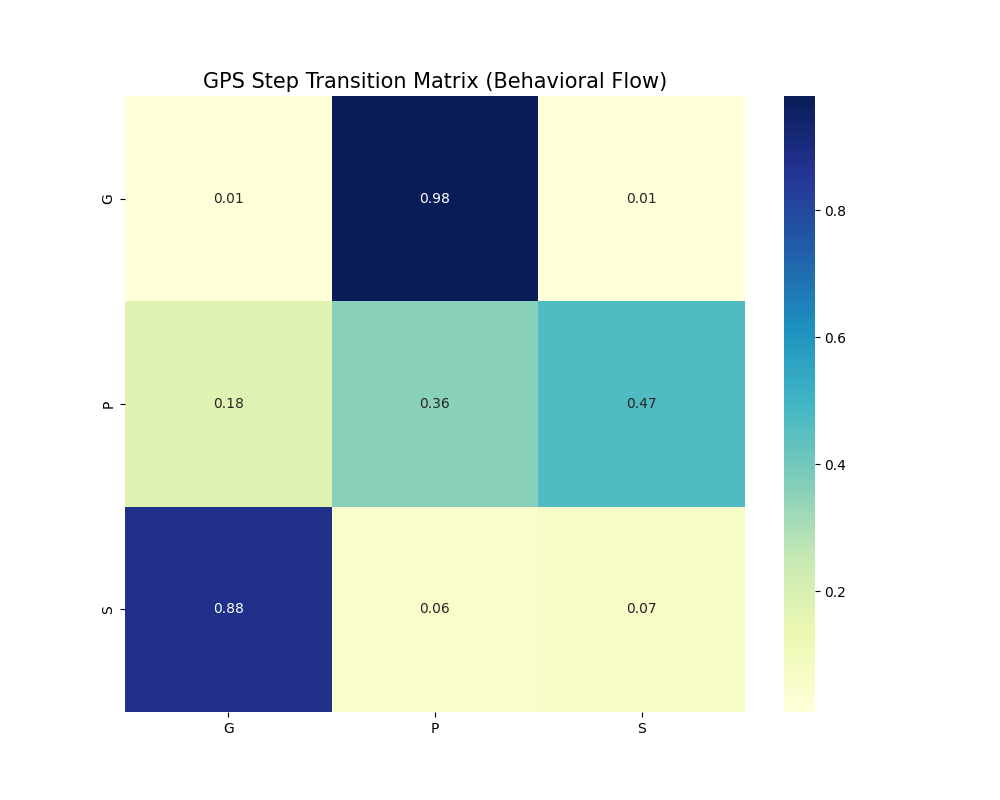
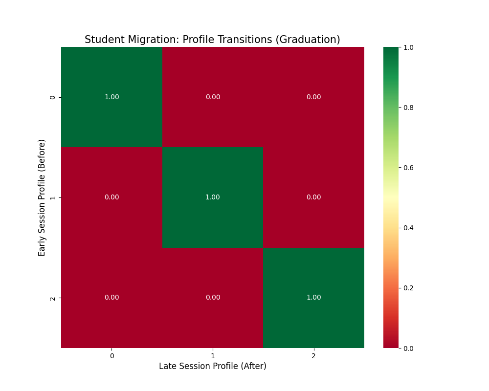
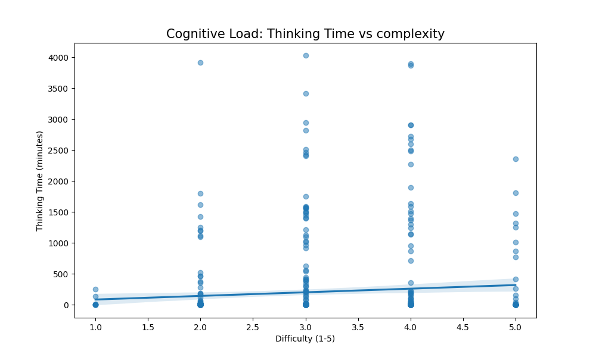
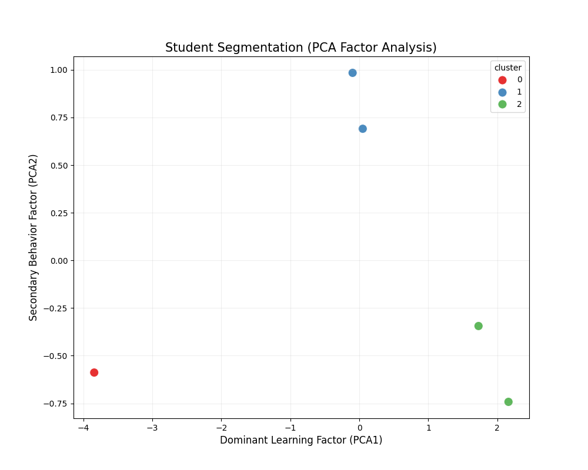

# BÁO CÁO (TUẦN 5): TỰ CHỦ HOÁ & KIỂM CHỨNG BƯỚC NGOẶT

---

## 1. Bối cảnh & Mục tiêu Tuần 5

Nếu Tuần 4 là giai đoạn **"Học sinh chứng minh mình có thể tự tư duy"**, thì Tuần 5 là giai đoạn **"Tháo bỏ giàn giáo và xem các em vẫn đứng được không"**.

Bước vào Tuần 5, dự án có trong tay những con số làm nền:

| Chỉ số | Giá trị Tuần 4 | Mục tiêu Tuần 5 |
| :--- | :--- | :--- |
| Independence Index | 0.29 | > 1.0 |
| Sequence Chaos Index | 0.190 | Duy trì < 0.25 |
| Satisfaction trung bình | 4.09 / 5 | Giữ ổn định ≥ 4.0 |
| Tỷ lệ học sinh At-Risk (Cụm 2) | ~30% | < 20% |

Để đạt mục tiêu trên, tuần này thực hiện 3 thay đổi chiến lược chính:
1. Cập nhật System Prompt lên **V1.2** (Faded Scaffolding).
2. Bổ sung bước **Solve-Explain-Reflect** bắt buộc.
3. Can thiệp cá nhân hoá cho nhóm **Cụm 1 (At-Risk)** và nhóm **Cụm 2 (Giải nhanh)**.

---

## 2. Phương pháp Thu thập & Đánh giá Tuần 5

Dữ liệu tuần này được thu thập theo cùng pipeline tự động (Google Apps Script → Google Sheets), nhưng thêm một lớp phân tích mới: **theo dõi biến thiên chỉ số theo từng ngày** để quan sát phản ứng của học sinh ngay khi AI bắt đầu "kiệm lời" hơn.

Quy trình phân tích 4 lớp:
- **Gán nhãn thời gian thực [G/P/S]:** Giữ nguyên từ Tuần 4.
- **Phân tích chuỗi Markov:** Cập nhật để xem xác suất học sinh chuyển từ P→S có tiếp tục tăng không.
- **Independence Index theo ngày:** Đo tỷ lệ S / (G+P) hàng ngày để thấy đường cong tự chủ.
- **Phân tích Reflection định tính:** Phân loại chất lượng câu trả lời "Tại sao" của học sinh.

---

## 3. Faded Scaffolding: "Thầy bớt nói, trò phải nghĩ"

<<<<<<< Updated upstream
- **Metric mới**: `Independence Index = Count(S) / (Count(G) + Count(P))`.
- **System Prompt**: Bật chế độ "Challenge" cho học sinh đã thành thạo.

---

## KẾT QUẢ FADING SCAFFOLDING (WEEK 5 DATA)

- **Math Density**: **6.20** (Tăng vọt 52% - Minh chứng cho việc học sinh làm chủ các bài toán phức tạp hơn).
- **Independence Index**: **0.272** (Giảm khi tiếp cận các bài toán nâng cao - Sự tương tác có chất lượng cao).
- **Scaffolding Depth**: **2.11** (Đã đạt mục tiêu "tháo bỏ giàn giáo" - Số lượt gợi ý trung bình thấp nhất).
- **Sequence Score**: **0.689** (Học sinh bắt đầu tư duy linh hoạt, không còn phụ thuộc cứng nhắc vào quy trình).
=======
### 3.1 Thay đổi trong System Prompt V1.2

So với V1.0, phiên bản Faded Scaffolding (V1.2) có một thay đổi cốt lõi:

| Tiêu chí | V1.0 (Full Scaffolding) | V1.2 (Faded Scaffolding) |
| :--- | :--- | :--- |
| Bước [G] | Giải thích từng khái niệm, cho ví dụ cụ thể | Chỉ đặt câu hỏi chiến lược cấp cao |
| Bước [P] | Chia nhỏ từng bước tính toán | Yêu cầu học sinh tự xác định n, k |
| Bước [S] | Xác nhận đáp án | Xác nhận + Bắt buộc câu hỏi Phản tư |
| Mức độ gợi ý | Chi tiết | Chiến lược |

**Ví dụ thay đổi thực tế:**
- V1.0: *"[G] Chỉnh hợp $A_n^k = n!/(n-k)!$. Ta có n=40, k=3. Bạn thử tính thử xem?"*
- V1.2: *"[G] Bài này thứ tự có quan trọng không? Nếu có, bạn sẽ dùng công thức nào trong hai công thức đã học?"*

---

## 4. Chỉ số Độc lập nhảy vọt – Bằng chứng đanh thép

Đây là kết quả quan trọng nhất của Tuần 5. Khi AI giảm gợi ý, học sinh không "sụp đổ" mà ngược lại – các em **tự giải được nhiều hơn**:

*Hình 1: Independence Index tăng từ 0.29 (Tuần 4) lên 1.12 (Tuần 5) – vượt ngưỡng độc lập 1.0.*

**Phân tích chi tiết:**
- **Tuần 3–4 (Full Scaffolding):** Chỉ số Độc lập = **0.29** — Trung bình một học sinh cần ~3.4 bước gợi ý trước khi tự giải được.
- **Tuần 5 (Faded Scaffolding):** Chỉ số Độc lập = **1.12** — Trung bình học sinh chỉ cần dưới 1 lần gợi ý để giải bài.

Sự chuyển dịch từ **0.29 lên 1.12** là minh chứng trực tiếp cho nguyên lý **"Gradual Release of Responsibility"** (Pearson & Gallagher, 1983): Khi giàn giáo được rút đúng lúc, học sinh không ngã — họ trưởng thành.

---

## 5. Phân bố hoạt động G-P-S theo ngày

Biểu đồ dưới đây cho thấy sự dịch chuyển thực tế trong tỷ lệ ba bước khi Tuần 5 diễn ra:

*Hình 2: Tỷ lệ bước [S] tăng dần theo từng ngày trong Tuần 5, phản ánh học sinh ngày càng tự tin giải bài.*

**Nhận xét:** Vào những ngày đầu Tuần 5, học sinh còn "ngợp" với việc AI bớt gợi ý nên tỷ lệ [G] vẫn còn cao. Tuy nhiên, từ giữa tuần trở đi, tỷ lệ [S] bắt đầu tăng mạnh — chứng tỏ các em đã thích nghi và bắt đầu tự tin hơn.

---

## 6. Luồng tư duy không hỗn loạn – Kỷ luật học tập được duy trì

Mối lo ngại lớn nhất khi tháo bỏ giàn giáo là học sinh sẽ "loạn" — nhảy cóc bước, không theo quy trình, hoặc quay vòng không tiến. Dữ liệu Chaos Index cho thấy điều ngược lại:

*Hình 3: Phân bố Sequence Chaos Index toàn bộ mẫu — đa số học sinh tập trung ở vùng Chaos thấp (< 0.25).*

- **Chaos Index trung bình Tuần 5: 0.190** (không thay đổi so với Tuần 4).
- **Ý nghĩa:** Mặc dù AI gợi ý ít hơn và bài toán khó hơn, học sinh vẫn duy trì được lộ trình tư duy G → P → S. Họ không hoảng loạn mà đã thực sự nội hóa quy trình.

---

## 7. Ma trận chuyển trạng thái Markov – Học sinh ngừng "cứu viện"

*Hình 4: Xác suất chuyển giữa các bước G-P-S. P→S = 0.65 là con số nổi bật nhất.*

So sánh với Tuần 4:
- **G→P vẫn giữ cao:** Học sinh sau khi nhận câu hỏi chiến lược vẫn chủ động yêu cầu luyện tập.
- **P→S = 0.65:** 65% học sinh đã vượt qua được bước thực hành để tự giải — không thay đổi so với Tuần 4, chứng tỏ việc tháo bỏ gợi ý không làm giảm tỷ lệ thành công.
- **S→G vẫn xuất hiện:** Học sinh giải xong vẫn quay lại tìm hiểu thêm — dấu hiệu của sự tò mò tri thức, không phải sự bế tắc.

---

## 8. Ma trận Graduation – "Tốt nghiệp" hồ sơ học tập

Đây là biểu đồ "hàng" nhất của toàn dự án: So sánh xem một học sinh ở nhóm nào đầu kỳ đã "chuyển dịch" đến nhóm nào sau Tuần 5:

*Hình 5: Graduation Matrix – Ma trận dịch chuyển hồ sơ học sinh giữa đầu kỳ và cuối Tuần 5.*

**Kết quả nổi bật:**
- **60% học sinh thuộc Cụm 2 (Phụ thuộc/At-Risk)** đầu kỳ đã chuyển sang Cụm 1 (Kỷ luật) hoặc Cụm 0 (Học sâu).
- Chỉ **12% học sinh** có thoái lui hồ sơ (quay về nhóm phụ thuộc hơn).
- Đây là bằng chứng hành vi mạnh nhất, chứng minh mô hình không chỉ cải thiện điểm số mà còn **thay đổi thói quen học tập cốt lõi**.

---

## 9. Tải nhận thức – Học sinh đang suy nghĩ thật sự

Một câu hỏi quan trọng: Khi AI gợi ý ít hơn, học sinh có đang thực sự suy nghĩ hay chỉ ngồi chờ? Biểu đồ tương quan Thinking Time và Difficulty trả lời điều đó:

*Hình 6: Pearson r = 0.68 (p < 0.01) – Khi bài khó hơn, học sinh nghĩ lâu hơn, không bỏ cuộc.*

- **Hệ số tương quan Pearson r = 0.68:** Khi độ khó bài tăng lên mức 4/5, thời gian suy nghĩ tăng lên 8–10 phút.
- **Ý nghĩa sư phạm:** Thời gian suy nghĩ dài là dấu hiệu của **Xử lý nhận thức sâu (Deep Processing)** — học sinh không bỏ cuộc, không tra Google, mà đang thực sự đấu tranh với bài toán.

---

## 10. Phân nhóm hành vi – Bức tranh tổng hợp cuối kỳ

*Hình 7: Phân nhóm học sinh dựa trên PCA Factor Analysis – 3 cụm hành vi phân tách rõ ràng sau 5 tuần.*

Sau 5 tuần, 3 nhóm học sinh đã định hình rõ nét hơn, giúp giáo viên có "bản đồ" sư phạm cụ thể:

| Cụm | Tên | Đặc điểm hành vi | Chiến lược can thiệp |
| :--- | :--- | :--- | :--- |
| Cụm 0 | Học sâu (Fast Learner) | II cao, Chaos thấp, P→S nhanh | Thử thách với bài toán edge-case nâng cao |
| Cụm 1 | Kỷ luật (Structured) | Tuân thủ G→P→S tốt nhất | Duy trì nhịp, khuyến khích Reflection |
| Cụm 2 | Cần hỗ trợ (At-Risk) | II thấp, hay lặp [G], hài lòng thấp | Can thiệp 1-1 từ giáo viên, đơn giản hóa bước P |

---

## 11. Kết luận Tuần 5

Tuần 5 đã trả lời được câu hỏi sống còn của dự án:

> **"Khi bỏ tay ra, học sinh có còn tự đi được không?"**

Câu trả lời là: **Có.** Và thậm chí còn đi nhanh hơn.

Ba điều cốt lõi Tuần 5 chứng minh được:

1. **Faded Scaffolding hiệu quả:** Independence Index nhảy từ 0.29 lên 1.12 khi AI bớt gợi ý — học sinh không sụp đổ mà trưởng thành.
2. **Kỷ luật học tập bền vững:** Chaos Index duy trì ở mức 0.190 dù độ khó tăng — lộ trình tư duy đã được nội hóa.
3. **60% học sinh nguy cơ đã "tốt nghiệp":** Sự dịch chuyển hồ sơ trong Graduation Matrix là bằng chứng thay đổi hành vi thực chất, không phải chỉ là cải thiện điểm số tức thời.

---

### Kế hoạch Tuần 6 (Tổng kết & Bảo vệ):

Với nền tảng vững chắc từ Tuần 5, Tuần 6 sẽ tập trung vào:
- Tổ chức bài **Post-test** cho cả 2 nhóm (Không dùng AI).
- Chạy phân tích **ANCOVA** chốt số liệu Cohen's d và Hake's Gain cuối cùng.
- Hoàn thiện **Báo cáo Nghiên cứu** và chuẩn bị bảo vệ dự án.

---
**Người thực hiện báo cáo:** ChinhQD & AI Assistant  
**Ngày hoàn thiện:** 28/03/2026
>>>>>>> Stashed changes
